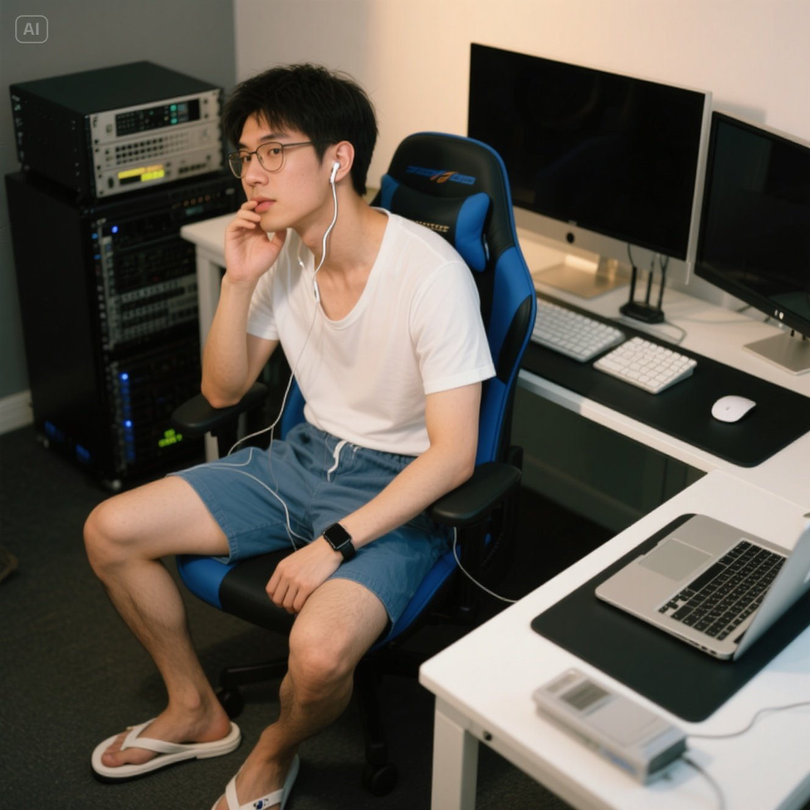

<div align="center">



# TrueNine

**Visually impaired developer building accessible, maintainable open-source software.**

Kotlin & Spring | TypeScript & Vue | Rust & Tauri

*From open source, give back to open source.*

[Projects](#featured-projects) | [What I care about](#what-i-care-about) | [Acknowledgments](#acknowledgments)

</div>

## Hello

I'm TrueNine, a full-stack developer from China. I use NVDA and Windows Magnifier in my daily work to write code, design systems, review changes, and maintain open-source projects.

For me, accessibility is not a slogan or a special mode added at the end. It is part of good engineering: clear interfaces, predictable behavior, useful feedback, and tools that work for more people.

Right now, I focus on reusable developer tooling, AI-assisted engineering workflows, and practical ways to make software easier to build and use.

## Featured projects

| Project | What it does | Built with |
| --- | --- | --- |
| [memory-sync](https://github.com/TrueNine/memory-sync) | Keeps one set of AI coding rules synchronized across multiple tools, with both a CLI and desktop app. | Rust, Tauri, TypeScript |
| [compose-server](https://github.com/TrueNine/compose-server) | Provides reusable backend components for Kotlin and Spring applications. | Kotlin, Spring Boot |
| [compose-client](https://github.com/TrueNine/compose-client) | Collects reusable frontend tooling and components for modern web applications. | TypeScript, Vue |

## What I care about

- **Accessibility by default** - software should remain understandable and operable with assistive technology.
- **Maintainable systems** - strong boundaries, explicit contracts, and code that survives beyond the first release.
- **Test-driven development** - feedback should arrive early, before mistakes become architecture.
- **Practical AI workflows** - AI should improve engineering judgment, not replace it.
- **Sustainable open source** - shared tools get better when knowledge and improvements flow back to the community.

## Toolbox

```text
Backend    Kotlin | Spring Boot | Ktor | PostgreSQL | Redis
Frontend   TypeScript | Vue | Nuxt | UnoCSS | Vite
Desktop    Rust | Tauri
Workflow   TDD | Clean Architecture | Git | Docker | Gradle
AI tools   Codex | Claude Code | Cursor | Hermes Agent | OpenCode
```

## Acknowledgments

No open-source journey is a solo effort. I am grateful to the friends, mentors, developers, and communities whose encouragement, guidance, and work have helped me keep learning and building.

### Supporters

- [one-eyed-fish](https://github.com/one-eyed-fish), author of [tdd-skill](https://github.com/one-eyed-fish/tdd-skill) and Codex Skills, for supporting my work and sharing a strong approach to TDD
- [zjarlin](https://github.com/zjarlin)
- [LiTeXz](https://github.com/LiTeXz)
- [WhoFish0015](https://github.com/WhoFish0015)

If you would like to support my work, you can make a donation through [Alipay](./.assets/alipay_qrcode.jpg). Every contribution is sincerely appreciated.

### Open-source projects and communities

My work has benefited greatly from the people behind these projects and platforms:

- [Jimmer ORM](https://github.com/babyfish-ct/jimmer)
- [Spring Framework](https://spring.io/)
- [Vue.js](https://vuejs.org/)
- [Kotlin](https://kotlinlang.org/)
- [NVDA](https://github.com/nvaccess/nvda)
- [GitHub](https://github.com/)
- [Bilibili](https://bilibili.com/)

I also appreciate JetBrains, Microsoft, Google, technical writers, educators, documentation maintainers, and cloud service providers whose tools and resources make independent development possible.

### Accessibility community

Special thanks go to the people and organizations advancing accessible technology, advocating for disabled people, and helping more people participate in the technology industry. NVDA, Windows Magnifier, accessibility researchers, volunteers, and advocates are essential to my daily work and to a more inclusive software community.

### Contributors

Thank you to everyone who reports bugs, suggests features, improves documentation, submits pull requests, joins technical discussions, or shares my projects. Every contribution helps make the work more useful and sustainable.

To contribute, open an issue or pull request in the relevant repository. Stars, thoughtful feedback, documentation improvements, and project recommendations are equally welcome.

## Let's connect

I'm always happy to discuss software architecture, developer tooling, open source, and accessibility. The best way to reach me is through the issues and discussions in the relevant repository.

You can also find my published packages on [npm](https://www.npmjs.com/~falsezero) and [Maven Central](https://central.sonatype.com/namespace/io.github.truenine) ([org.truenine](https://central.sonatype.com/namespace/org.truenine)).

<div align="center">

**Build thoughtfully. Share openly. Leave the path more accessible than you found it.**

</div>
